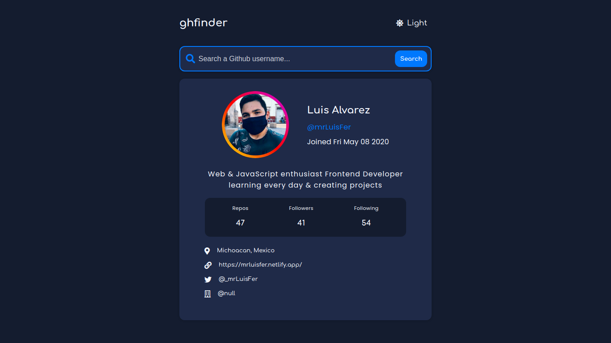

# ⚡ Github Profile Searcher

## 📘 About
This is a simple project, based on a Frontend Mentor challenge

It is a github user profile finder, which uses Octokit to use the github api and Vite to load all the files in a minified package

## 🌿 Contribute
You can contribute with a pull request, to add styles, fix functionalities or something

You can also make a fork to change and customize what you want

## 💼 Contact Me
If you want to contact me you can do it through these social networks

- [🐙 github.com/mrLuisFer](https://github.com/mrLuisFer)

- [🐦 twitter.com/_mrLuisFer](https://twitter.com/_mrLuisFer)

- [☁ linkedinmrluisfer](https://www.linkedin.com/in/mrluisfer/)
